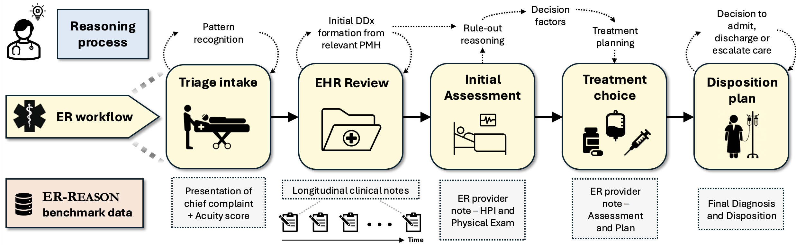

---
hide:
  - navigation
---

## A Benchmark Dataset for LLM-Based Clinical Reasoning in the Emergency Room

  <a href="https://arxiv.org/abs/2505.22919" class="box">Paper</a>
  <a href="https://github.com/AlaaLab/ER-Reason" class="box">GitHub</a>
  <a href="coming soon" class="box">Dataset</a>

---

Large language models (LLMs) are increasingly applied to the field of medicine, but most benchmarks focus on narrow, exam-style medical question-answering rather than full clinical reasoning. ER-Reason captures the end-to-end emergency room (ER) decision-making pipeline, designed to test how well LLMs can approximate the complex, real-world reasoning of clinicians in high-stakes settings. 

---

## Key Components

### Dataset
- **3,984 patients** across **3,984 ER encounters**
- **25,174 de-identified clinical notes**
- Diverse note types: discharge summaries, progress notes, imaging reports, consult notes, echocardiography reports, and ER provider documentation

### Workflow-Aligned Tasks
This benchmark is structured around **five key stages of the ER workflow**:

1. **Triage Intake:** initial review of patient presentation and acuity scoring  
2. **Assessment:** summarization of patient's medical history in longitudinal notes  
3. **Treatment Planning:** assessment of differential diagnoses and clinical decision factors  
4. **Disposition:** determination of whether the patient should be discharged, admitted, observed, or transferred  
5. **Final Diagnosis:** formulation of the patient's final diagnosis  

### Physician-Authored Rationales
- Includes **72 expert-authored rationales** explaining their clinical decision-making process
- Provides a rare "gold standard" for evaluating reasoning in medical decisions, often a missing component in traditional EHR data

---

ER-Reason represents a major step forward in benchmarking the real-world applicability of LLMs in emergency care. By moving beyond factual recall, it evaluates models on **true clinical reasoning, pattern recognition, and decision-making** under realistic conditions.

